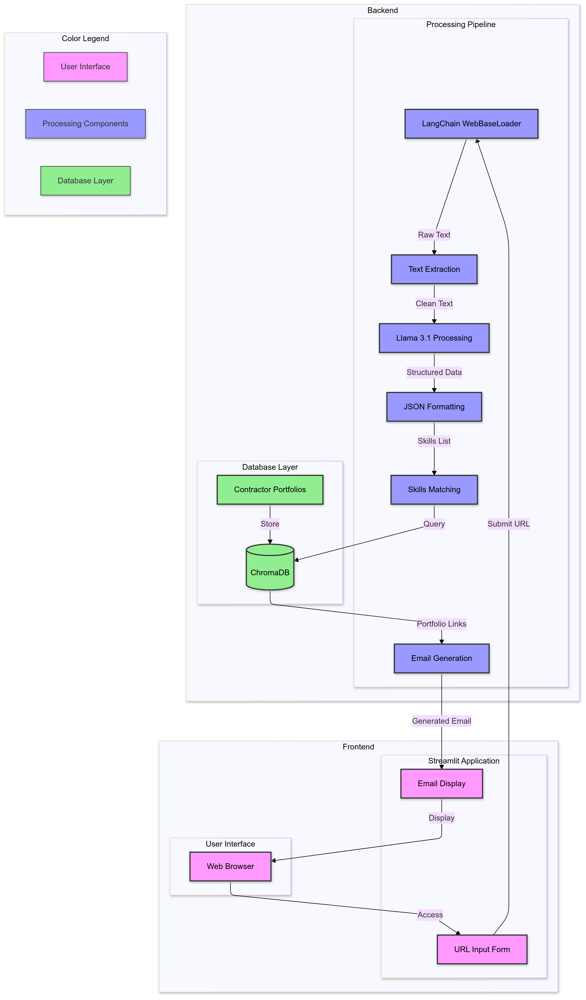

# 🤖 Llama Cold Email Generator 

## 📊 Project Overview

This project helps HR outsourcing firms efficiently match their tech contractors with job openings at large companies in the US, to help the tech firms hire engineers with lower costs.

Using Llama 3.1 and LangChain, it automatically extracts job requirements from company career pages, matches them with HR outsourcing firms contractor portfolios, and generates personalized cold emails highlighting relevant skills, portfolio links, and cost advantages.

## 🏗️ Project Architecture

### Backend Flow
- Extract job posting content using LangChain's WebBaseLoader
- Process text through Llama 3.1 to generate structured JSON format
- Query ChromaDB to match required skills with contractor portfolios
- Generate personalized cold emails using LangChain prompt template

### Frontend
- Streamlit-based interface for URL input
- Display of generated emails

### Overall Workflow
When a business development manager inputs a job posting URL -> streamlit frontend -> LangChain backend -> Llama 3.1 -> ChromaDB -> Generate a tailored cold email and display it on the frontend

## 💻 Tech Stack

- **Backend Storage**: ChromaDB (because it's a lightweight vector database)
- **Frontend**: Streamlit (because it's a Python library for building simple web apps)
- **LLM Model**: Llama 3.1 via groq.cloud (using Groq API key for faster inference)
- **Framework**: LangChain
- **Language**: Python

## 🎥 Demo

You can watch the video demo: [youtube](https://youtu.be/KS0ShCQTc04)

## 📝 Detailed Project Workflow

### 1. Define Business Problem
- **Big Tech Perspective**: Struggling to fill specialized roles due to high costs and limited local talent
- **HR Firms Perspective**: Need efficient way to match contractors with job requirements and automate outreach

### 2. Define User Profile
- HR outsourcing firms managing tech contractors from lower cost regions like India, Latin America, and Eastern Europe
- Focus on placing software engineers, data analysts, and other tech professionals, because they are the most common roles that are expensive to hire in the US and suitable for outsourcing

### 3. Define Value Proposition
- Automates cold email personalization
- Fast skill matches between contractors and job requirements
- Emphasizes cost advantages
- Streamlines outreach process

### 4. Development Process
#### 4.1 Notebook Testing ([experiments](experiments/))
##### Step 1: LLM Integration Testing ([email_generator.ipynb](experiments/email_generator.ipynb))
- **Install necessary libraries**: Installed LangChain and LangChain-Groq libraries
- **Test Llama 3.1 API integration**:  Called the Llama 3.1 API, test it with a few queries to see if the response makes sense
- **Experiment with job posting extraction**: Experimented using WebBaseLoader from LangChain to extract job posting content from a test url
- **Refine prompts**: Refined prompts to extract relevant information without unnecessary content. Need to specify "no preamble" because the AI is too verbose
- **Implement JsonOutputParser**: Implemented JsonOutputParser from LangChain to structure extracted data into a JSON format

##### Step 2: ChromaDB Testing ([tutorial_chromadb.ipynb](experiments/tutorial_chromadb.ipynb)) 
- **Initialized ChromaDB**: Initialized ChromaDB client and created collection
- **Add Documents**: Added test documents with location metadata for testing
- **Test If Query Works**: Validated vector similarity search functionality
- **Test If Adding Metadata Works**: Tested metadata integration with external links. Confirmed relevance-based result ranking

##### Step 3: Portfolio Data Integration ([email_generator.ipynb](experiments/email_generator.ipynb))
- **Store Data into DB**: Loaded contractor portfolio data into ChromaDB
- **Test If Skill Keyword Matching Works**: Tested skill keyword matching
- **Test If Portfolio Link Retrieval Works**: Validated portfolio link retrieval with real job requirements

##### Step 4: Cold Email Generation ([email_generator.ipynb](experiments/email_generator.ipynb))
- **Created Email Instructions**: Developed email templates using PromptTemplate. Incorporated the writer's identity, firm's value proposition,  job requirements and matched portfolio links
- **Iteratively Refined Prompts**: Iteratively refined prompts for optimal output

#### 4.2 App Development
Move the code from the notebook into the app folder and create a streamlit app
- **Utils** (`app/utils.py`): Implemented text cleaning functions to process raw job postings
- **Database** (`app/portfolio.py`): Built ChromaDB integration for portfolio storage and matching
- **LLM Backend** (`app/chains.py`): Integrated Llama 3.1 API with job extraction and email generation
- **UI** (`app/main.py`): Created Streamlit interface for URL input and sequential backend processing

## 🚀 Future Improvements

### 1. **Automated Job Posting Scraping**: 
- The app currently requires manual URL input for each job posting, making it time-consuming for HR firms to process multiple positions. 
Develop an automated scraping system that can automatically extract relevant job postings based on predefined criteria and generate emails for all matching positions.

### 2. **More Sophisticated Skill Extraction**: 
-The current skill extraction is not very good. when the skillsets are not that clearly listed on the job posting, the AI will not be able to extract and parse the skills.
- Implement a more sophisticated skill extraction system that can extract and parse skills from job postings, even if they are not clearly listed.

### 3. **Enhanced Matching Algorithm**: 
- The current matching system uses basic vector similarity search, which might miss nuanced skill relationships or experience levels. 
- Implement a more sophisticated matching system that uses skill taxonomy to understand related technologies and considers experience levels and skill hierarchies.

### 4. **Multi-language Support**: 
- The system currently only processes English job postings and generates English emails. 
- Expand the system to process job postings and generate emails in multiple languages.

